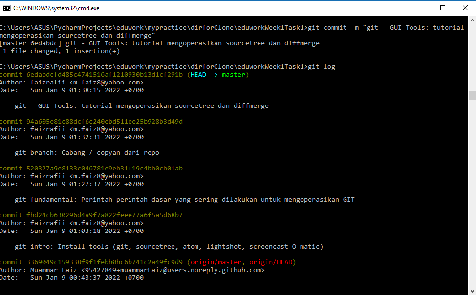

####"rangkum semua materi git buat dalam bentuk commit"
- git intro: Install tools (git, sourcetree, atom, lightshot, screencast-O matic)
- git fundamental: "Perintah perintah dasar yang sering dilakukan untuk mengoperasikan GIT"
  - git init
  - git config
  - git status
  - git add
  - git commit
  - git clone
  - git remote
  - git push
  - git pull
- git branch: "Cabang / copyan dari repo"
  - git branch
  - git branch --all
  - git branch nama-branch
  - git checkout nama-branch
  - git branch -d nama-branch
- git - GUI Tools: tutorial mengoperasikan sourcetree dan diffmerge.

